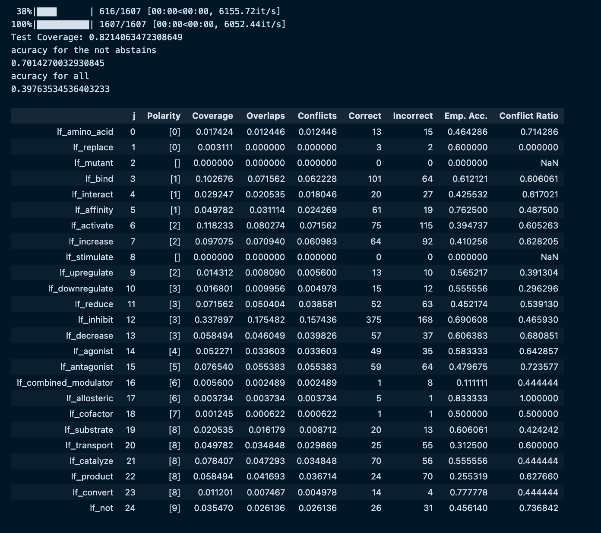

# Label Functions


We include the details for ChemProt LFs improvement at path [ChemProt](chemprot).


## Utility
We include the notebooks for label functions in this directory:

- `label_improve.py`: This python script contains two important functions help us to evaluate the quality of each indvidual label functions. 


``` python
import label_improve as li

# Example usage this funciton evaluate the quality of each individual label functions in lfs.
li.analysis_LFs(lfs, df,class_size)

# This function evaluate the quality of the weak labels in the df
li.analysis_LFs_with_weak_labels(df, class_size):
```

Example output:



# LLM assit LF construction

notebook: `llm_{datasetname}.ipynb` consist of the code to use LLM to assist the construction of label functions. The prompt for the LLM is included in `llm_prompt` directory. The result of using 'gpt-4o-2024-08-06' as basline model is included in `llm_baseline` directory.