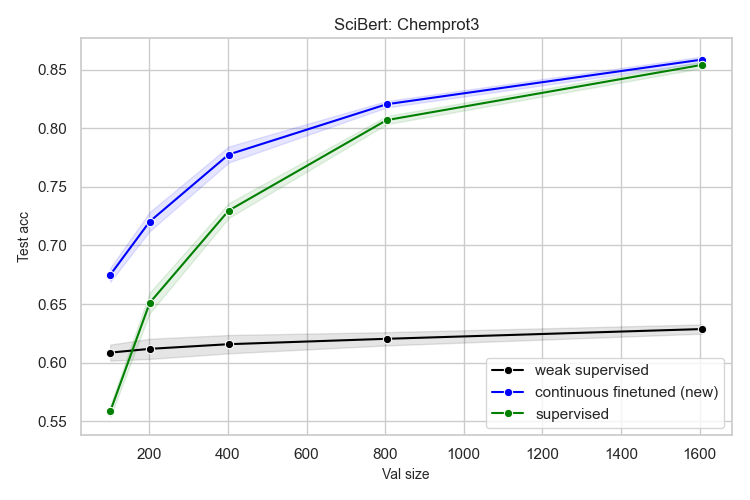
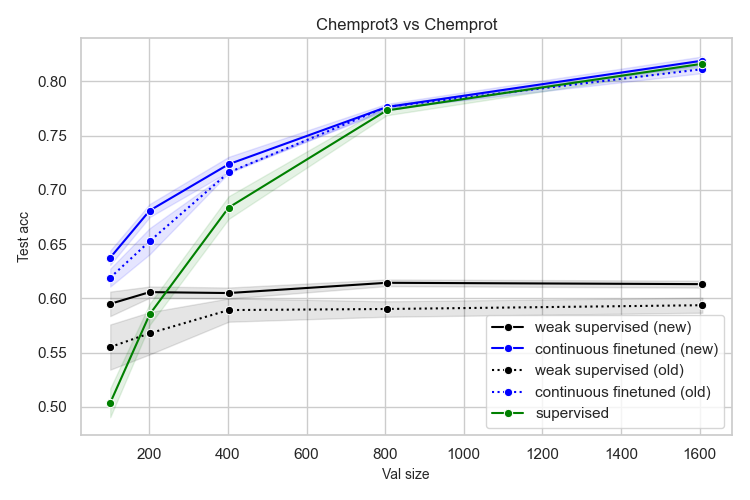

# Chemprot LF analysis

We included the results of SciBERT and the details for improving the LFs for Chemprot dataset in this document.

# SciBERT

We used in-domain [SciBERT, a pretrained language model for scientific text](https://arxiv.org/abs/1903.10676) to test whether the cross over point is still consistent. The cross over point is even higher in this case. Suggesting the usefulness of weak supervision.



# LF improve for Chemprot 

We described the details of how we improve the LFs for Chemprot dataset in this document.

## Original LFs: 

This label funcitons has a coverage of 0.8637 and precision of 0.5512 on the covered data, with accuracy of 0.4904 with Majority Vote and random tie-breaking ([Wrench](https://arxiv.org/abs/2109.11377) reported their accuracy in this way). The statistics is obtained from the test set.

We sampled a development set from the training set with size 250, examine the definition of each label, and carefully look at the examples of each label to understand the characteristics of the dataset.

The details for each LF are shown below:

``` python
# chemprot functions:
ABSTAIN = -1
### Keyword based labeling functions ###

## Part of
#0
@labeling_function()
def lf_amino_acid(x):
    return 0 if 'amino acid' in x.text.lower() else ABSTAIN
#1
@labeling_function()
def lf_replace(x):
    return 0 if 'replace' in x.text.lower() else ABSTAIN
#2
@labeling_function()
def lf_mutant(x):
    return 0 if 'mutant' in x.text.lower() or 'mutat' in x.text.lower() else ABSTAIN
#3
## Regulator
@labeling_function()
def lf_bind(x):
    return 1 if 'bind' in x.text.lower() else ABSTAIN
#4
@labeling_function()
def lf_interact(x):
    return 1 if 'interact' in x.text.lower() else ABSTAIN
#5
@labeling_function()
def lf_affinity(x):
    return 1 if 'affinit' in x.text.lower() else ABSTAIN
#6
## Upregulator
# Activator
@labeling_function()
def lf_activate(x):
    return 2 if 'activat' in x.text.lower() else ABSTAIN
#7
@labeling_function()
def lf_increase(x):
    return 2 if 'increas' in x.text.lower() else ABSTAIN
#8
@labeling_function()
def lf_induce(x):
    return 2 if ' induc' in x.text.lower() else ABSTAIN
#9
@labeling_function()
def lf_stimulate(x):
    return 2 if 'stimulat' in x.text.lower() else ABSTAIN
#10
@labeling_function()
def lf_upregulate(x):
    return 2 if 'upregulat' in x.text.lower() else ABSTAIN
#11
## Downregulator
@labeling_function()
def lf_downregulate(x):
    return 3 if 'downregulat' in x.text.lower() or 'down-regulat' in x.text.lower() else ABSTAIN
#12
@labeling_function()
def lf_reduce(x):
    return 3 if 'reduc' in x.text.lower() else ABSTAIN
#13
@labeling_function()
def lf_inhibit(x):
    return 3 if 'inhibit' in x.text.lower() else ABSTAIN
#14
@labeling_function()
def lf_decrease(x):
    return 3 if 'decreas' in x.text.lower() else ABSTAIN

#15
## Agonist
@labeling_function()
def lf_agonist(x):
    return 4 if ' agoni' in x.text.lower() or "\tagoni" in x.text.lower() else ABSTAIN

#16
## Antagonist
@labeling_function()
def lf_antagonist(x):
    return 5 if 'antagon' in x.text.lower() else ABSTAIN

#17
## Modulator
@labeling_function()
def lf_modulate(x):
    return 6 if 'modulat' in x.text.lower() else ABSTAIN

#18
@labeling_function()
def lf_allosteric(x):
    return 6 if 'allosteric' in x.text.lower() else ABSTAIN
#19
## Cofactor
@labeling_function()
def lf_cofactor(x):
    return 7 if 'cofactor' in x.text.lower() else ABSTAIN
#20
## Substrate/Product
@labeling_function()
def lf_substrate(x):
    return 8 if 'substrate' in x.text.lower() else ABSTAIN
#21
@labeling_function()
def lf_transport(x):
    return 8 if 'transport' in x.text.lower() else ABSTAIN
#22
@labeling_function()
def lf_catalyze(x):
    return 8 if 'catalyz' in x.text.lower() or 'catalys' in x.text.lower() else ABSTAIN
#23
@labeling_function()
def lf_product(x):
    return 8 if "produc" in x.text.lower() else ABSTAIN
#24
@labeling_function()
def lf_convert(x):
    return 8 if "conver" in x.text.lower() else ABSTAIN
#25
## NOT
@labeling_function()
def lf_not(x):
    return 9 if 'not' in x.text.lower() else ABSTAIN
```

We carefully examine the analysis on the development set, and get the following table.

Definitions for each term:

1. **Coverage**: The proportion of data points labeled by a specific label function (LF).

2. **Overlaps**: The occurrence of multiple LFs labeling the same data point.

3. **Conflicts**: Instances where different LFs assign conflicting labels to the same data point.

4. **Correct**: The number of data points an LF labels correctly, based on known ground truth.

5. **Incorrect**: The number of data points an LF labels incorrectly, based on known ground truth.

6. **Empirical Accuracy (Emp. Acc.)**: The ratio of correct labels to the total labels assigned by an LF.

7. **Conflict Ratio**: Conflicts over coverage. The proportion of conflicts relative to the total labels assigned by an LF.

On the development set: The label functions have coverage 0.888, with 0.527 precision on the covered data, and 0.476 accuracy with Majority Vote and random tie-breaking.

| Unnamed: 0      | Polarity   |   Coverage |   Overlaps |   Conflicts |   Correct |   Incorrect |   Emp. Acc. |   Conflict Ratio |
|:----------------|:-----------|-----------:|-----------:|------------:|----------:|------------:|------------:|-----------------:|
| lf_amino_acid   | [0]        |      0.036 |      0.028 |       0.02  |         4 |           5 |   0.444444  |         0.555556 |
| lf_replace      | [0]        |      0.004 |      0     |       0     |         0 |           1 |   0         |         0        |
| lf_mutant       | [0]        |      0.016 |      0.016 |       0.008 |         1 |           3 |   0.25      |         0.5      |
| lf_bind         | [1]        |      0.12  |      0.096 |       0.08  |        20 |          10 |   0.666667  |         0.666667 |
| lf_interact     | [1]        |      0.028 |      0.024 |       0.016 |         5 |           2 |   0.714286  |         0.571429 |
| lf_affinity     | [1]        |      0.036 |      0.024 |       0.016 |         5 |           4 |   0.555556  |         0.444444 |
| lf_activate     | [2]        |      0.096 |      0.076 |       0.06  |         9 |          15 |   0.375     |         0.625    |
| lf_increase     | [2]        |      0.068 |      0.052 |       0.044 |         5 |          12 |   0.294118  |         0.647059 |
| lf_induce       | [2]        |      0.228 |      0.18  |       0.16  |        15 |          42 |   0.263158  |         0.701754 |
| lf_stimulate    | [2]        |      0.048 |      0.028 |       0.024 |         1 |          11 |   0.0833333 |         0.5      |
| lf_upregulate   | [2]        |      0.004 |      0     |       0     |         1 |           0 |   1         |         0        |
| lf_downregulate | [3]        |      0.004 |      0.004 |       0.004 |         0 |           1 |   0         |         1        |
| lf_reduce       | [3]        |      0.064 |      0.06  |       0.056 |         6 |          10 |   0.375     |         0.875    |
| lf_inhibit      | [3]        |      0.376 |      0.196 |       0.188 |        63 |          31 |   0.670213  |         0.5      |
| lf_decrease     | [3]        |      0.04  |      0.036 |       0.032 |         6 |           4 |   0.6       |         0.8      |
| lf_agonist      | [4]        |      0.06  |      0.048 |       0.048 |         6 |           9 |   0.4       |         0.8      |
| lf_antagonist   | [5]        |      0.088 |      0.072 |       0.072 |        12 |          10 |   0.545455  |         0.818182 |
| lf_modulate     | [6]        |      0.016 |      0.012 |       0.012 |         0 |           4 |   0         |         0.75     |
| lf_allosteric   | [6]        |      0     |      0     |       0     |         0 |           0 |   0         |       nan        |
| lf_cofactor     | [7]        |      0.004 |      0.004 |       0.004 |         1 |           0 |   1         |         1        |
| lf_substrate    | [8]        |      0.016 |      0.008 |       0.008 |         2 |           2 |   0.5       |         0.5      |
| lf_transport    | [8]        |      0.036 |      0.024 |       0.024 |         5 |           4 |   0.555556  |         0.666667 |
| lf_catalyze     | [8]        |      0.008 |      0     |       0     |         2 |           0 |   1         |         0        |
| lf_product      | [8]        |      0.044 |      0.04  |       0.04  |         2 |           9 |   0.181818  |         0.909091 |
| lf_convert      | [8]        |      0.004 |      0.004 |       0.004 |         0 |           1 |   0         |         1        |
| lf_not          | [9]        |      0.104 |      0.092 |       0.092 |         4 |          22 |   0.153846  |         0.884615 |

## LF improvement details
We first started by adding space around or before keywords: " activat", " increas", "reduc", " antagon", " transport", " catalyz", " produc" and " not ". This is because for keywords for example "not", it might be activated by "notable" or other words that contain "not".

Our second step is look over functions that has low accuracy on the developement set, and improve or remove them. We first remove funciton lf_induce, this is becasue when printing out which example this lf is wrong on our developement set. There isn't any obvious pattern that we can use to improve this lf, and also induce is a very general word that can be used in many different context. 

Our next step is to write some utility functions on the datasets to help us write better LFs. We develope a function called `chemprot_enhanced` in our label_improve.py to extend the chemprot dataframe with two more columns called entity1_index and entity2_index. This two index is the position according to words of the two entities in the text. 

We then improve our LFs to utilize these two new columns. This is because for words like stimulate, upregulate, downregulate, they are usually between the two entities. We can use the two index to check if the word is between the two entities. In addition, for words like mutant, they are usually close to the entities. We can use the two index to check if the word is close to the entities.

On the development set: Our coverage dropped to 0.828 and accuracy for the covered data increased to 0.5942. The accuracy with Majority Vote and random tie-breaking is 0.508, after these improvements.

When then ask for suggestions from a Neuroscientist Phd student, and after carefully looking through the labels and examples in the development set, he told us in this dataset, the entity are usually a certain type of compound for a specific relation. For example, the `part of ` relation usually has entity2 as an amino acid. This is also why in the original LFs, lf_amino_acid check for the keywords  `amino acid`. He then talked about how there are only fintely many amino acids, and we can use this information to improve our LFs. Additionally, he also mentioned that the number of `cofactors` is also finte. He mentioned the subset relationship of regulator and upregulator ,downregulator, and explain to us what `modulator` is. Further he also introduced us what `catalyze` is and why ` enzyme` and `metabolized`. The exclusion relation of Substrate/Product relation and inhibitor relation also helped us in further improving our LFs. Finally, we changed the following funcitons according to his suggestions:

lf_amino_acid, lf_upregulate, lf_downregulate, lf_cofactor, lf_substrate, lf_inhibit, lf_modulate, lf_product, lf_calatlyze, lf_not.

On the development set: Our coverage of the LFs changed to 0.82, with an accuracy of 0.6439 on the covered data. The accuracy with Majority Vote and random tie-breaking is 0.544(wrench accuracy).

## Final results:


On the test set: Our coverage of the LFs changed to 0.8102, with an accuracy of 0.6321 on the covered data. The accuracy with Majority Vote and random tie-breaking is 0.5302(wrench accuracy). This is a 8% increase on the covered data, and 4% increase on the whole dataset.


## Our final LFs:

We included the analysis table of the development set and the improved LFs below:


``` python
# chemprot functions:
ABSTAIN = -1

# alanine, arginine, asparagine, aspartic acid, cysteine, glutamic acid, glutamine, glycine, histidine, isoleucine, leucine, lysine, methionine, phenylalanine, proline, serine, threonine, tryptophan, tyrosine, and valine.
amino_acids = [
    "alanine", "ala", "a",
    "arginine", "arg", "r",
    "asparagine", "asn", "n",
    "aspartic acid", "asp", "d",
    "cysteine", "cys", "c",
    "glutamine", "gln", "q",
    "glutamic acid", "glu", "e",
    "glycine", "gly", "g",
    "histidine", "his", "h",
    "isoleucine", "ile", "i",
    "leucine", "leu", "l",
    "lysine", "lys", "k",
    "methionine", "met", "m",
    "phenylalanine", "phe", "f",
    "proline", "pro", "p",
    "serine", "ser", "s",
    "threonine", "thr", "t",
    "tryptophan", "trp", "w",
    "tyrosine", "tyr", "y",
    "valine", "val", "v"
]

@labeling_function()
def lf_amino_acid(x):
    if "which is present in" in x.text.lower():
        return 0
    if x.entity2.lower() in amino_acids:
        return 0
    return -1

@labeling_function()
def lf_replace(x):
    return 0 if 'replace' in x.text.lower() else ABSTAIN

@labeling_function()
def lf_mutant(x):
    def find_word_index(words, target):
        for i, word in enumerate(words):
            if target in word:
                return i
        return -1

    words = x.text.lower().split()
    if any(' mutant' in word or ' mutat' in word for word in words):
        # if mutant is between the two entities
        if x.entity1_index == -1 or x.entity2_index == -1:
            return ABSTAIN
        if isinstance(x.entity1_index, int) and isinstance(x.entity2_index, int):
            if x.entity1_index < x.entity2_index:
                if any(' mutant' in word or ' mutat' in word for word in words[x.entity1_index:x.entity2_index]):
                    return 0
            else:
                if any(' mutant' in word or ' mutat' in word for word in words[x.entity2_index:x.entity1_index]):
                    return 0
        # if mutant is close to either of the entities
        mutant_index = find_word_index(words, ' mutant')
        mutat_index = find_word_index(words, ' mutat')
        if (mutant_index != -1 and (abs(x.entity1_index - mutant_index) < 4 or abs(x.entity2_index - mutant_index) < 4)) or \
           (mutat_index != -1 and (abs(x.entity1_index - mutat_index) < 4 or abs(x.entity2_index - mutat_index) < 4)):
            return 0
    return ABSTAIN


@labeling_function()
def lf_bind(x):
    return 1 if 'bind' in x.text.lower() else ABSTAIN

@labeling_function()
def lf_interact(x):
    return 1 if 'interact' in x.text.lower() else ABSTAIN

@labeling_function()
def lf_affinity(x):
    return 1 if 'affinit' in x.text.lower() else ABSTAIN

@labeling_function()
def lf_activate(x):
    return 2 if ' activat' in x.text.lower() else ABSTAIN

@labeling_function()
def lf_increase(x):
    return 2 if ' increas' in x.text.lower() else ABSTAIN

@labeling_function()
def lf_stimulate(x):
    # if stimulate is between the two entities
    if x.entity1_index == -1 or x.entity2_index == -1:
        return ABSTAIN
    if isinstance(x.entity1_index, int) and isinstance(x.entity2_index, int):
        if x.entity1_index < x.entity2_index:
            if x.text[x.entity1_index:x.entity2_index].count('stimulat') > 0:
                return 2
        else:
            if x.text[x.entity2_index:x.entity1_index].count('stimulat') > 0:
                return 2
    return ABSTAIN

@labeling_function()
def lf_upregulate(x):
    if ('upregulat' in x.text.lower() or 'up-regulat' in x.text.lower()) and ('downregulat' in x.text.lower() or 'down-regulat' in x.text.lower()):
        entity1_index = x.text.lower().index(x.entity1.lower())
        entity2_index = x.text.lower().index(x.entity2.lower())
        # if up regulate is between the two entities
        if isinstance(entity1_index, int) and isinstance(entity2_index, int):
            if entity1_index < entity2_index:
                if x.text[entity1_index:entity2_index].count('upregulat') > 0 or x.text[entity1_index:entity2_index].count('up-regulat') > 0:
                    return 2
            else:
                if x.text[entity2_index:entity1_index].count('upregulat') > 0 or x.text[entity2_index:entity1_index].count('up-regulat') > 0:
                    return 2
        return ABSTAIN
    else:
        return 2 if 'upregulat' in x.text.lower() or 'up-regulat' in x.text.lower() else ABSTAIN

@labeling_function()
def lf_downregulate(x):
    if('downregulat' in x.text.lower() or 'down-regulat' in x.text.lower()) and ('upregulat' in x.text.lower() or 'up-regulat' in x.text.lower()):
        if x.entity1_index == -1 or x.entity2_index == -1:
            return ABSTAIN
        # if up regulate is between the two entities
        if isinstance(x.entity1_index, int) and isinstance(x.entity2_index, int):
            if x.entity1_index < x.entity2_index:
                if x.text[x.entity1_index:x.entity2_index].count('downregulat') > 0 or x.text[x.entity1_index:x.entity2_index].count('down-regulat') > 0:
                    return 3
            else:
                if x.text[x.entity2_index:x.entity1_index].count('downregulat') > 0 or x.text[x.entity2_index:x.entity1_index].count('down-regulat') > 0:
                    return 3
        return ABSTAIN
    return 3 if 'downregulat' in x.text.lower() or 'down-regulat' in x.text.lower() else ABSTAIN

#12
@labeling_function()
def lf_reduce(x):
    return 3 if ' reduc' in x.text.lower() else ABSTAIN

#13
@labeling_function()
def lf_inhibit(x):
    return 3 if 'inhibit' in x.text.lower() else ABSTAIN
#14
@labeling_function()
def lf_decrease(x):
    return 3 if 'decreas' in x.text.lower() else ABSTAIN
#15
## Agonist
@labeling_function()
def lf_agonist(x):
    return 4 if ' agoni' in x.text.lower() or "\tagoni" in x.text.lower() else ABSTAIN

#16
## Antagonist
@labeling_function()
def lf_antagonist(x):
    return 5 if ' antagon' in x.text.lower() else ABSTAIN

#17
## Modulator
@labeling_function()
def lf_modulate(x):
    return 6 if 'modulat' in x.text.lower() else ABSTAIN

#18
@labeling_function()
def lf_allosteric(x):
    return 6 if 'allosteric' in x.text.lower() else ABSTAIN
#19
## Cofactor

cofactors = [
    # Organic Cofactors
    "adenosine triphosphate",
    "nicotinamide adenine dinucleotide",
    "nicotinamide adenine dinucleotide phosphate",
    "flavin adenine dinucleotide",
    "flavin mononucleotide",
    "coenzyme a",
    "pyridoxal phosphate",
    "thiamine pyrophosphate",
    "tetrahydrofolate",
    "biotin",
    "lipoic acid",
    "s-adenosylmethionine",
    "heme",
    "tetrahydrobiopterin",
    "ubiquinone",
    "molybdopterin",
    "cobalamin",
    "folate",
    "s-adenosylhomocysteine", "sah",

    # Inorganic Cofactors (Metal Ions)
    "iron", "fe2+", "fe3+",
    "magnesium",
    "zinc",
    "copper",
    "manganese",
    "calcium",
    "molybdenum",
    "selenium", "selenocysteine",
    "cobalt",
]

@labeling_function()
def lf_cofactor(x):
    return 7 if 'cofactor' in x.text.lower() else ABSTAIN
#20
## Substrate/Product
@labeling_function()
def lf_substrate(x):
    return 8 if 'substrate' in x.text.lower() else ABSTAIN
#21
@labeling_function()
def lf_transport(x):
    return 8 if ' transport' in x.text.lower() else ABSTAIN
#22
@labeling_function() 
def lf_catalyze(x):
    if " enzyme" in x.text.lower() or "metabolized" in x.text.lower():
        return 8
    return 8 if 'catalyz' in x.text.lower() or 'catalys' in x.text.lower() else ABSTAIN
#23
@labeling_function()
def lf_product(x):
    if any(kw in x.text.lower() for kw in [
        "inhibit", "inhibition", "inhibitory", "block", "blockade", "blocked", 
        "decrease", "decreased", "reduction", "reduced", 
        "suppress", "suppression", 
        "no effect", "no change", 
        "fail", "failure", "failed to produce", 
        "antagonist", "antagonize", "antagonized", 
        "negative", "negative regulation", 
        "downregulate", "downregulation", "downregulated", 
        "weakly inhibited", "weak inhibition"
    ]):
        return -1
    if " production" in x.text.lower() and " NO " in x.text:
      if "inhibit" not in x.text:
        return 8
    if " production" in x.text.lower():
      return ABSTAIN
      
    return 8 if " produc" in x.text.lower() else ABSTAIN
#24
@labeling_function()
def lf_convert(x):
    return 8 if "conver" in x.text.lower() else ABSTAIN
#25
## NOT
@labeling_function()
def lf_not(x):
    entity1_index = x.text.lower().index(x.entity1.lower())
    entity2_index = x.text.lower().index(x.entity2.lower())
    # if the two entities are close to the word 'not'

    if ' not ' in x.text.lower():
        if abs(entity1_index - x.text.lower().index(' not ')) < 20 or abs(entity2_index - x.text.lower().index(' not ')) < 20:
            return 9
        if abs(entity1_index - x.text.lower().index(' not ')) < 40 or abs(entity2_index - x.text.lower().index(' not ')) < 40:
            if entity1_index < entity2_index:
                if x.text[entity1_index:entity2_index].count(' not ') > 0:
                    return 9
            else:
                if x.text[entity2_index:entity1_index].count(' not ') > 0:
                    return 9
    if ' no ' in x.text.lower():
        if abs(entity1_index - x.text.lower().index(' no ')) < 20 or abs(entity2_index - x.text.lower().index(' no ')) < 20:
            return 9
        # if not is between the two entities
        if abs(entity1_index - x.text.lower().index(' no ')) < 40 or abs(entity2_index - x.text.lower().index(' no ')) < 40:
            if entity1_index < entity2_index:
                if x.text[entity1_index:entity2_index].count(' no ') > 0:
                    return 9
            else:
                if x.text[entity2_index:entity1_index].count(' no ') > 0:
                    return 9

    return ABSTAIN

@labeling_function()
def lf_combined_modulator(x):
    sentence_lower = x.text.lower()

    specific_terms = ['allosteric modulator', 'positive modulator', 'negative modulator', 'non-competitive modulator', 'positive allosteric modulator']
    if any(term in sentence_lower for term in specific_terms):
        return 6

    modulating_terms = ['modulat', 'allosteric', 'potentiate']
    for term in modulating_terms:
        if term in sentence_lower:
            term_index = sentence_lower.index(term)
            if x.entity1_index == -1 or x.entity2_index == -1:
                return ABSTAIN
            if abs(term_index - x.entity1_index) < 20 or abs(term_index - x.entity2_index) < 20:
                return 6

    if x.entity1 in sentence_lower and x.entity2 in sentence_lower:
        entity1_index = sentence_lower.index(x.entity1.lower())
        entity2_index = sentence_lower.index(x.entity2.lower())
        between_entities = sentence_lower[min(entity1_index, entity2_index):max(entity1_index, entity2_index)]
        if 'modulate' in between_entities:
            return 6

    if 'positive' in sentence_lower and 'modulator' in sentence_lower:
        pos_indices = [i for i, word in enumerate(sentence_lower.split()) if word == 'positive']
        mod_indices = [i for i, word in enumerate(sentence_lower.split()) if 'modulator' in word]
        if len(pos_indices) == 0 or len(mod_indices) == 0:
            return ABSTAIN
        min_distance = min(abs(p - m) for p in pos_indices for m in mod_indices)
        if min_distance <= 3:
            return 6
    return ABSTAIN

lfs = [lf_amino_acid, lf_replace, lf_mutant, lf_bind, lf_interact, lf_affinity, lf_activate, lf_increase, lf_stimulate, lf_upregulate, lf_downregulate, lf_reduce, lf_inhibit, lf_decrease, lf_agonist, lf_antagonist, lf_combined_modulator, lf_allosteric, lf_cofactor, lf_substrate, lf_transport, lf_catalyze, lf_product, lf_convert, lf_not]
```

| Unnamed: 0            | Polarity   |   Coverage |   Overlaps |   Conflicts |   Correct |   Incorrect |   Emp. Acc. |   Conflict Ratio |
|:----------------------|:-----------|-----------:|-----------:|------------:|----------:|------------:|------------:|-----------------:|
| lf_amino_acid         | [0]        |      0.072 |      0.052 |       0.052 |        10 |           8 |    0.555556 |         0.722222 |
| lf_replace            | [0]        |      0.004 |      0     |       0     |         0 |           1 |    0        |         0        |
| lf_mutant             | [0]        |      0     |      0     |       0     |         0 |           0 |    0        |       nan        |
| lf_bind               | [1]        |      0.12  |      0.088 |       0.076 |        20 |          10 |    0.666667 |         0.633333 |
| lf_interact           | [1]        |      0.028 |      0.024 |       0.02  |         5 |           2 |    0.714286 |         0.714286 |
| lf_affinity           | [1]        |      0.036 |      0.024 |       0.016 |         5 |           4 |    0.555556 |         0.444444 |
| lf_activate           | [2]        |      0.084 |      0.06  |       0.048 |         9 |          12 |    0.428571 |         0.571429 |
| lf_increase           | [2]        |      0.064 |      0.052 |       0.044 |         4 |          12 |    0.25     |         0.6875   |
| lf_induce             | [2]        |      0.228 |      0.18  |       0.152 |        15 |          42 |    0.263158 |         0.666667 |
| lf_stimulate          | [2]        |      0     |      0     |       0     |         0 |           0 |    0        |       nan        |
| lf_upregulate         | [2]        |      0.016 |      0.012 |       0.004 |         1 |           3 |    0.25     |         0.25     |
| lf_downregulate       | [3]        |      0.004 |      0.004 |       0.004 |         0 |           1 |    0        |         1        |
| lf_reduce             | [3]        |      0.056 |      0.048 |       0.04  |         6 |           8 |    0.428571 |         0.714286 |
| lf_inhibit            | [3]        |      0.376 |      0.188 |       0.176 |        63 |          31 |    0.670213 |         0.468085 |
| lf_decrease           | [3]        |      0.04  |      0.032 |       0.028 |         6 |           4 |    0.6      |         0.7      |
| lf_agonist            | [4]        |      0.06  |      0.044 |       0.044 |         6 |           9 |    0.4      |         0.733333 |
| lf_antagonist         | [5]        |      0.088 |      0.064 |       0.064 |        12 |          10 |    0.545455 |         0.727273 |
| lf_combined_modulator | [6]        |      0     |      0     |       0     |         0 |           0 |    0        |       nan        |
| lf_allosteric         | [6]        |      0     |      0     |       0     |         0 |           0 |    0        |       nan        |
| lf_cofactor           | [7]        |      0.004 |      0.004 |       0.004 |         1 |           0 |    1        |         1        |
| lf_substrate          | [8]        |      0.016 |      0.012 |       0.008 |         2 |           2 |    0.5      |         0.5      |
| lf_transport          | [8]        |      0.036 |      0.024 |       0.024 |         5 |           4 |    0.555556 |         0.666667 |
| lf_catalyze           | [8]        |      0.048 |      0.016 |       0.012 |        11 |           1 |    0.916667 |         0.25     |
| lf_product            | [8]        |      0.012 |      0.012 |       0.012 |         1 |           2 |    0.333333 |         1        |
| lf_convert            | [8]        |      0.004 |      0.004 |       0.004 |         0 |           1 |    0        |         1        |
| lf_not                | [9]        |      0.028 |      0.028 |       0.028 |         2 |           5 |    0.285714 |         1        |